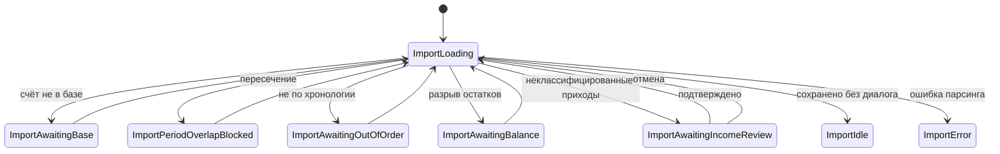

# Импорт выписки — проверка приходов

## Контекст

- При импорте выписки операции сохраняются как `BankStatementOperations` без классификации.
- В системе есть справочник арендаторов (`Renters`) и категорий прочих приходов (`IncomeCategories`), но импорт их не использует.
- Ближайший аналог по UX — диалог `ImportBaseCreationDialog`: импорт останавливается, пользователь принимает решение, импорт продолжается.
- Не каждый приход в выписке — платёж от арендатора. Встречаются проценты, возвраты, переводы, прочие поступления без узнаваемого контрагента.
- Цель: при импорте показать **одно модальное окно** со списком **неклассифицированных приходов**, чтобы пользователь мог проверить парсинг и указать, что это за операция.

---

## Цель

При импорте выписки, если в **приходах** есть операции, которые программа не смогла автоматически отнести к известному арендатору, показать диалог со списком таких приходов. Пользователь для каждой позиции:

- видит, что распарсила программа (дата, сумма, назначение; для контрагента — имя и р/с);
- при необходимости правит имя и р/с контрагента;
- выбирает классификацию:
  - **арендатор** (создать / привязать к существующему);
  - **прочий приход** (категория из справочника);
  - **без классификации** (оставить просто банковской операцией);
- подтверждает и продолжает импорт.

### Не в scope v1

- Редактирование суммы/даты операций в диалоге.
- Автосоздание документов прихода (`IncomeDocument`).
- Зачёт по начислениям (`RenterAssignment`).
- Анализ расходов (debit-операций).

---

## Пользовательский сценарий

```
Импорт XLS
    ↓
Парсинг + проверки (база, период, остатки) — как сейчас
    ↓
Анализ приходов: автосопоставление с известными арендаторами
    ↓
┌─ Все приходы классифицированы автоматически ──→ Сохранить выписку
│
└─ Есть неклассифицированные приходы
       ↓
   Диалог «Проверка приходов»
       ↓
   [Продолжить импорт] ──→ Применить классификацию, сохранить
   [Отмена]             ──→ Выписка не сохраняется, переход к следующей в очереди
```

Диалог показывается **на каждую выписку** в очереди, у которой есть хотя бы одна позиция для проверки.

---

## Что попадает в диалог

### Автоматически классифицируется (диалог не нужен для этих операций)

- Приход, чей р/с плательщика (`debitBankAccount`) уже привязан к арендатору **текущей базы** → `renterId` проставляется автоматически.

### Попадает в диалог

Все остальные **приходы** (`credit != null`), кроме:

- переводов на **свой** счёт базы (внутренние движения);
- операций, уже получивших `renterId` при автосопоставлении.

В том числе:

| Пример | Тип карточки в диалоге |
|--------|------------------------|
| Платёж с неизвестного р/с | Группа контрагента |
| Проценты на остаток, без р/с плательщика | Одиночный приход |
| Возврат от банка / эквайринга | Одиночный приход |
| Поступление с р/с, но это не аренда (кредит, возврат займа) | Группа контрагента → пользователь выбирает «Прочий приход» |

---

## Диалог: структура экрана

### Заголовок

**Проверка приходов**

Подзаголовок: период выписки, номер счёта базы, количество позиций для проверки.

### Два типа карточек

#### 1. Карточка контрагента (группа по р/с)

Несколько приходов с одного р/с объединяются в одну карточку.

```
┌─────────────────────────────────────────────────────────────┐
│ Контрагент                                                  │
│ Имя          [ ООО "Ромашка"________________ ]              │
│ Р/с          [ 40702810...__________________ ]              │
│                                                             │
│ Классификация                                               │
│   (•) Арендатор                                             │
│       ( ) Создать    ( ) Привязать к [▼ Иванов         ]  │
│   ( ) Прочий приход  [▼ Возврат                        ]  │
│   ( ) Без классификации                                     │
│                                                             │
│ ▼ Приходы (3) — 45 000,00 ₽                                 │
│   12.03.2026   15 000,00   Оплата аренды за март            │
│   15.03.2026   15 000,00   Аренда помещения                 │
└─────────────────────────────────────────────────────────────┘
```

#### 2. Карточка одиночного прихода (без контрагента)

Операции без валидного чужого р/с — по одной карточке на операцию.

```
┌─────────────────────────────────────────────────────────────┐
│ 05.03.2026   1 250,00 ₽                                     │
│ Назначение   Вознаграждение за остаток на счёте             │
│                                                             │
│ Классификация                                               │
│   ( ) Арендатор  → при выборе: имя + р/с + создать/привязать│
│   (•) Прочий приход  [▼ Прочее                           ]  │
│   ( ) Без классификации                                     │
└─────────────────────────────────────────────────────────────┘
```

### Поведение полей

| Элемент | Поведение |
|---------|-----------|
| Имя / Р/с | Редактируемые; показываются при классификации «Арендатор» |
| Классификация | Три варианта: арендатор / прочий приход / без классификации |
| Подрежим арендатора | Создать нового или привязать к существующему |
| Селектор арендатора | Список арендаторов **текущей базы** (не архивные) |
| Селектор категории | Справочник `IncomeCategories` (активные) |
| Блок приходов | Только в карточке контрагента; свёрнут, если операций > 1 |

Операции в v1 — **только просмотр** (дата, сумма, назначение).

### Кнопки

| Кнопка | Действие |
|--------|----------|
| **Продолжить импорт** | Валидация → применение → сохранение |
| **Отмена** | Отмена импорта текущей выписки |

`barrierDismissible: false`.

### Размер

`maxWidth: 640`, `maxHeight: 80%` экрана.

---

## Правила анализа (matcher)

### Какие операции анализируем

Только **приходы**: `operation.credit != null`.

### Что отбрасываем (не показываем в диалоге)

- `debitBankAccount` совпадает со счётом **текущей базы** (внутренний перевод).

### Автоматическое сопоставление

`RentersStorage.findByAccount(debitBankAccount)` → арендатор с `baseId == baseId` выписки:

- всем операциям с этим р/с проставляем `renterId`;
- в диалог не попадают.

Если арендатор найден, но принадлежит **другой базе** → карточка контрагента в диалоге с предупреждением.

### Формирование позиций для диалога

Оставшиеся приходы делятся на два типа:

**A. Группа контрагента** — валидный чужой `debitBankAccount` (20 цифр):

- ключ группы: `debitBankAccount`;
- `suggestedName` — самое длинное непустое имя из операций группы;
- список операций с индексами.

**B. Одиночный приход** — пустой или невалидный `debitBankAccount`:

- одна карточка на операцию;
- имя контрагента не показывается (или пустое);
- при выборе «Арендатор» пользователь вводит р/с вручную.

### Когда диалог не показываем

Все приходы либо отфильтрованы, либо автоматически получили `renterId`.

---

## Доменная модель

### Расширение операции (domain + БД)

```dart
// bank_statement_operation.dart
final String? debitCounterpartyName;  // для UI импорта, в БД не храним
final String? renterId;               // nullable
final int? incomeCategoryId;          // nullable, прочий приход
```

`renterId` и `incomeCategoryId` **взаимоисключающие**: у операции может быть одно из двух или ни одного.

### Позиции для диалога

```dart
sealed class ImportIncomeReviewItem {}

/// Группа приходов с одного р/с
class ImportIncomeCounterpartyItem extends ImportIncomeReviewItem {
  final String originalAccountNumber;
  final String suggestedName;
  final List<ReviewableOperation> operations;
}

/// Один приход без узнаваемого контрагента
class ImportIncomeStandaloneItem extends ImportIncomeReviewItem {
  final ReviewableOperation operation;
}

class ReviewableOperation {
  final int statementOperationIndex;
  final DateTime date;
  final double amount;
  final String note;
}
```

### Результат анализа

```dart
class StatementIncomeReviewResult {
  final Map<int, String> autoMatchedRenterIds;
  final List<ImportIncomeReviewItem> reviewItems;
}
```

### Решение пользователя

```dart
enum ImportIncomeClassification {
  renter,
  other,
  unclassified,
}

enum ImportRenterAction { create, link }

class ImportIncomeResolution {
  /// Индексы операций, к которым относится решение
  final List<int> operationIndices;

  final ImportIncomeClassification classification;

  // для renter:
  final String? name;
  final String? accountNumber;
  final ImportRenterAction? renterAction;
  final String? linkedRenterId;

  // для other:
  final int? incomeCategoryId;
}
```

### Состояние импорта

```dart
final class ImportAwaitingIncomeReview extends ImportState {
  const ImportAwaitingIncomeReview({
    required this.statement,
    required this.baseId,
    required this.autoMatchedRenterIds,
    required this.reviewItems,
  });

  final BankStatement statement;
  final BaseId baseId;
  final Map<int, String> autoMatchedRenterIds;
  final List<ImportIncomeReviewItem> reviewItems;
}
```

---

## Поток в ImportController

### Точка вставки

В `_trySaveStatement`, после проверок остатков, **перед** `bankStatementStorage.save`:

```
1. base = findByAccount(statement.accountNumber)
2. reviewResult = matcher.analyze(statement, baseId: base.id)
3. if (reviewResult.reviewItems.isEmpty)
       → apply autoMatched, save
   else
       → state = ImportAwaitingIncomeReview(...)
       → return false
```

### Новые методы

```dart
Future<void> confirmIncomeReview(List<ImportIncomeResolution> resolutions)
Future<void> cancelIncomeReview()
```

### confirmIncomeReview

```
для каждого resolution:
  switch (classification):
    renter + create → Renter.create + save
    renter + link   → добавить р/с при необходимости + save
    other           → проставить incomeCategoryId на операции
    unclassified    → ничего

проставить renterId / incomeCategoryId на соответствующие operationIndices
применить autoMatchedRenterIds
save(statement)
продолжить очередь
```

### cancelIncomeReview

Удалить текущую выписку из очереди, продолжить импорт.

---

## Архитектура (слои)

```
data/
  bank_statements_importing/
    statement_income_review_analyzer.dart
    bank_statement_parser/
      sber_parser.dart                 — + имя контрагента
      vtb_parser.dart

  models/
    bank_statement_operation.dart      — + renterId, incomeCategoryId

  drift/models/
    bank_statement_operations_table.dart — + renter_id, income_category_id

view/
  controllers/
    import_controller.dart
    import_state.dart                  — ImportAwaitingIncomeReview

  widgets/
    import_income_review_dialog.dart
    import_state_listener.dart
```

### StatementIncomeReviewAnalyzer

Зависимости: `RentersStorage`, `BasesStorage`.

```dart
Future<StatementIncomeReviewResult> analyze(
  BankStatement statement, {
  required BaseId baseId,
});
```

### БД

**Миграция** `schemaVersion: 10 → 11`:

```sql
ALTER TABLE bank_statement_operations
ADD COLUMN renter_id TEXT REFERENCES renters (id) ON DELETE SET NULL;

ALTER TABLE bank_statement_operations
ADD COLUMN income_category_id INTEGER REFERENCES income_categories (id) ON DELETE SET NULL;
```

---

## Отображение в таблице документов

Колонка «Описание» — префикс по классификации:

| Классификация | Формат |
|---------------|--------|
| `renterId` | `{Имя арендатора}: {note}` |
| `incomeCategoryId` | `{Категория}: {note}` |
| нет | `{note}` |

Примеры:

- `Иванов И.И.: Оплата аренды за март`
- `Проценты: Вознаграждение за остаток на счёте`

---

## Валидация в диалоге

| Правило | Сообщение |
|---------|-----------|
| `renter` + create: имя не пустое | «Укажите имя арендатора» |
| `renter`: валидный р/с | «Номер р/с должен содержать 20 символов» |
| `renter` + link: выбран арендатор | «Выберите арендатора» |
| `other`: выбрана категория | «Выберите категорию» |
| Два `renter` + create с одним р/с | «Счёт … указан более одного раза» |
| `renter` + create: р/с уже в справочнике | «Счёт уже привязан к …» |

---

## Диаграмма состояний импорта



---

## Тесты

| Область | Сценарии |
|---------|----------|
| Analyzer | автосопоставление арендатора; группировка по р/с; одиночные приходы без р/с |
| Analyzer | фильтр своего счёта; арендатор другой базы |
| Парсер Сбера | извлечение имени контрагента |
| ImportController | пауза на review; renter / other / unclassified |
| Mapper/DB | renterId и incomeCategoryId сохраняются |
| DocumentsStorage | префиксы в описании |

---

## Этапы реализации

| # | Задача | Зависимости |
|---|--------|-------------|
| 1 | Парсер: имя контрагента | — |
| 2 | `renterId` + `incomeCategoryId` в модели + Drift v11 | — |
| 3 | `StatementIncomeReviewAnalyzer` + тесты | 1 |
| 4 | `ImportAwaitingIncomeReview` + controller | 3 |
| 5 | `ImportIncomeReviewDialog` (два типа карточек) | 4 |
| 6 | `ImportStateListener` | 5 |
| 7 | `DocumentsStorage`: префиксы в описании | 2 |
| 8 | Ручная проверка на реальной выписке | все |

---

## Принятые решения

1. **Диалог** — про все неклассифицированные приходы, не только про неизвестных арендаторов.
2. **Три варианта классификации** — арендатор / прочий приход / без классификации.
3. **Два типа карточек** — группа контрагента (по р/с) и одиночный приход (без р/с).
4. **Операции в диалоге** — только просмотр; правки имени и р/с на уровне контрагента.
5. **Отображение** — префикс в колонке «Описание», без новой колонки.
6. **Только приходы** — расходы не анализируем.
7. **Один диалог на выписку** — все позиции в одном окне.
